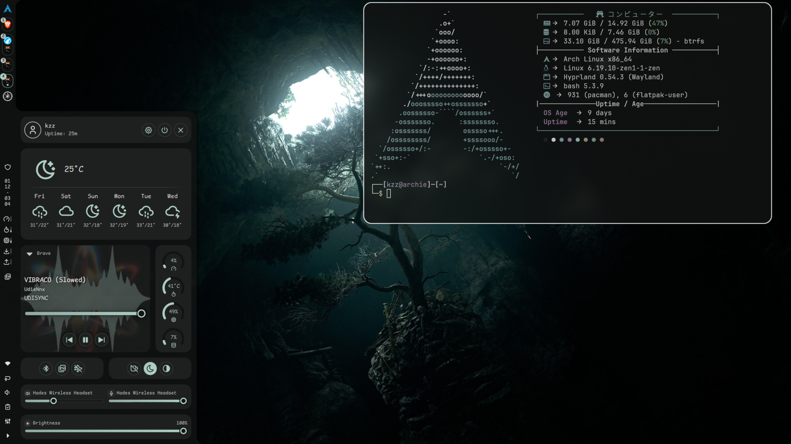
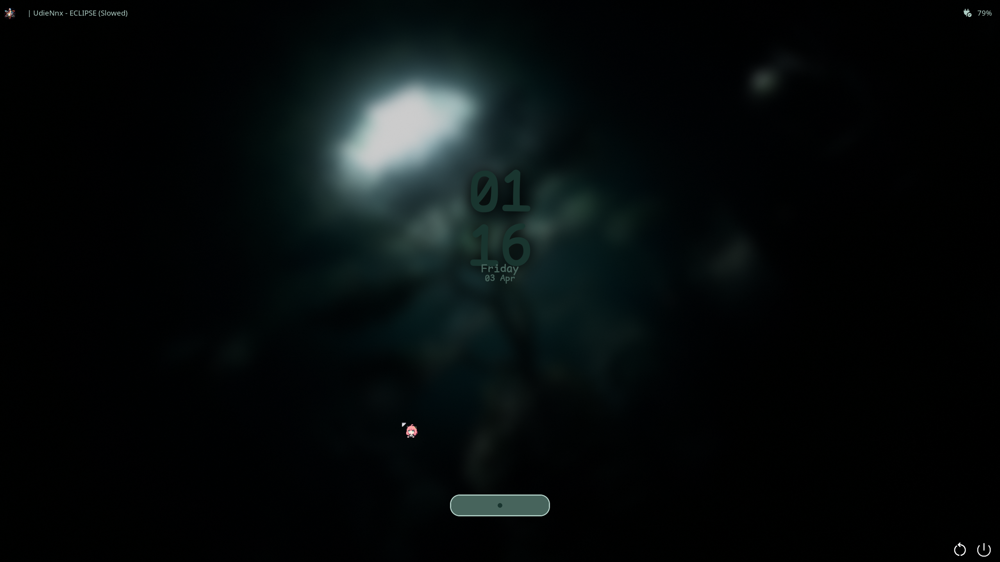
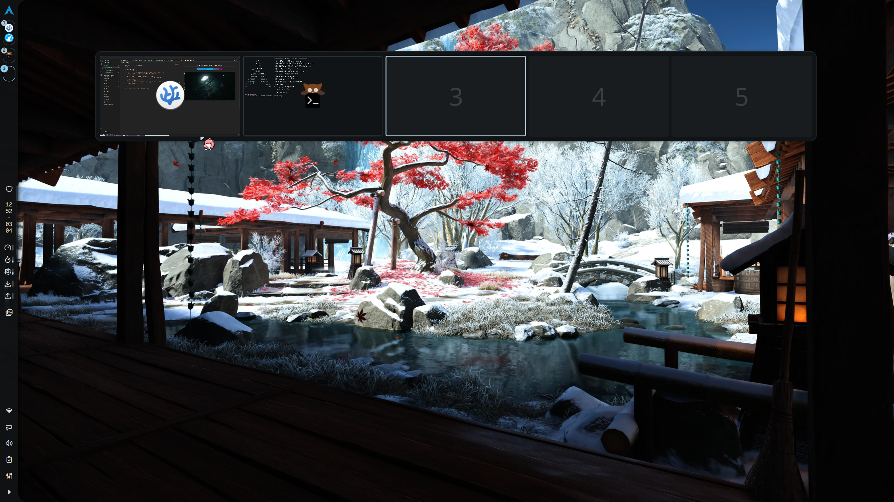
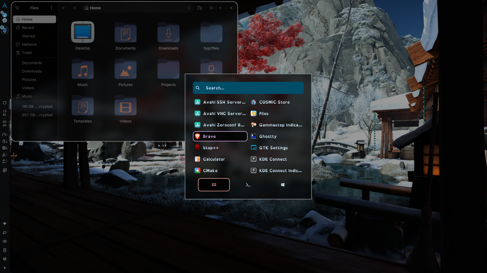
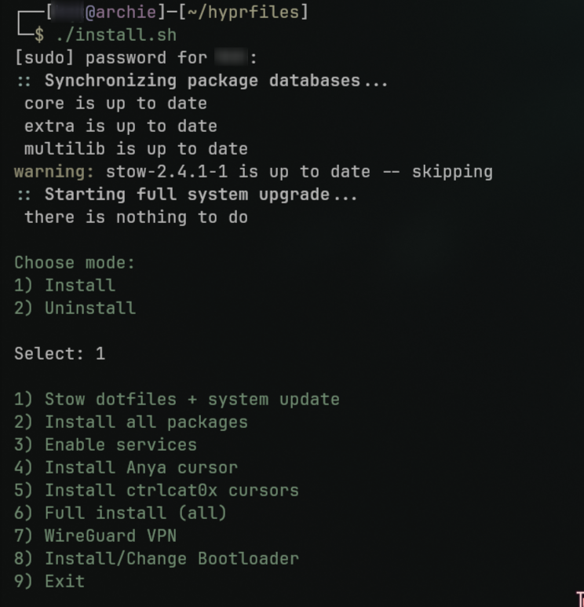

<h2 align="center">
A minimal Arch + Hyprland setup
</h2>

<p align="center">
  <a href="https://archlinux.org">
    
  </a>
  <a href="https://github.com/hyprwm/Hyprland">
    
  <a href="./LICENSE">
    
  </a>
</p>


<br>

<h2 align='left'>🖼️ Screenshots</h2>
<table align='center'>
    <tr>
        <th>Desktop</th>
        <th>lockscreen</th>
        <th>Overview</th>
        <th>Rofi</th>
    </tr>
    <tr>
        <td align="center">
            
        </td>
        <td align="center">
            
        </td>
        <td align="center">
            
        </td>
        <td align="center">
            
        </td>
    </tr>
    </tr>
</table>
<br>

<!-- | Desktop | Lockscreen | Overview | Rofi |
|:--------|:----------:|:--------:|-----:|
||||| -->

## ⚙️ Programs
<table align="center">
    <tr>
        <th>Name</th>
        <th>Note/Component</th>
    </tr>
    <tr>
        <td><a href="https://archlinux.org">Arch Linux</a></td>
        <td>Rolling release , minimal base <b>distro</b></td>
    </tr>
    <tr>
        <td><a href="https://hypr.land">Hyprland</a></td>
        <td>Wayland-native, Dynamic <b>TWM</b></td>
    </tr>
    <tr>
        <td><a href="https://nocatalia.dev">Noctalia-shell</a></td>
        <td>Desktop shell for <b>Bar,Notification,Wallpaper,App Launcher,Color Engine,OSD</b></td>
    </tr>
    <tr>
        <td><a href="https://github.com/kovidgoyal/kitty">Kitty</a></td>
        <td>Terminal</td>
    </tr>
    <tr>
        <td><a href="https://www.gnu.org/software/bash/">Shell</a></td>
        <td>Bash with <a href="https://github.com/akinomyoga/ble.sh">Ble.sh</a> in-line editor</td>
    </tr>
    <tr>
        <td><a href="https://davatorium.github.io/rofi/">Rofi</a></td>
        <td>Application switcher, Window switcher</td>
    </tr>
    <tr>
        <td><a href="https://iniox.github.io/#matugen">Matugen</a></td>
        <td>Color engine</td>
    </tr>
    <tr>
        <td><a href="https://github.com/Shanu-Kumawat/quickshell-overview">quickshell-overview</a></td>
        <td>A standalone workspace overview module for Hyprland using Quickshell. </td>
    </tr>
    <tr>
        <td><a href="https://github.com/GNOME/nautilus">Nautilus</a></td>
        <td>File manager</td>
    </tr>
    <tr>
        <td><a href="https://github.com/fastfetch-cli/fastfetch">Fastfetch</a></td>
        <td>System info on shell</td>
    </tr>
</table>
<br>

## ✨ Features
🎨 <b>Material you theming</b><br>
    Application are themed using material you colors fetched from current wallpaper using noctalia-shell color engine or matugen like rofi , qt5 & qt6 apps ( need manual apply from qt5ct and qt6ct app ), quickshell overview , hyprlock <br>

📥 <b>All-in-One Utilities</b>
    Noctalia-shell has it all notification , clipboard manager, logout menu, wallpaper switicher, bar no need for sperate program for everthing also `rofi` is configured as fallback  if noctalia-shell crashes ( noctalia and rofi run on same keybind so no need to remember different keybind for both ) 

🔄 <b>System update</b>
    A single script `sysupdate` to update whole system (pacman , aur , flatpak) and clear cache while storing logs at `~/.var/logs/sysupdate`

📜 <b>Custom Scripts</b>
    Bunch of custom scripts written in bash to optimize/setup like <br>
| Purpose                             | Usage                          |
|:------------------------------------|:-------------------------------|
| setting up ssh                      | `setup_ssh <your-email>`       |
| delete cliphist history with DB     | `cliphist-clear`               |
| install grub with theme             | `grub-install`                 |
| Laptop and pacman optimization      | `pac-lid.sh`                   |
| Install refind with theme           | `refind_install`               |
| Setup arch for gaming               | `gaming_nvidia_arch.sh`        |
    
all these will be stow-ed into `./local/bin` so just need to add `./local/bin` into `$PATH` if not already present 
<br>

## 🧩 Modular Hyprland Config
```
├── hyprland/
│   ├── keybind.conf            # All keybinds
│   ├── looknfeel.conf          # Gap, scrolling layout, blue, animations
│   ├── window.conf             # window & layer rules
├── hypridle.conf               # hypridle config
├── hyprland.conf               
└── hyprlock.conf
```
<br>

## 💿 Installation
⚠️ Backup your current config before proceeding beacause this will modify dir like `.config`  `.local/bin`<br>

### 1️⃣ Option (Manual)
#### 📦 Dependencies

❗ Install program from [⚙️ Programs](#programs) for minimal install additionally below pkg are needed
```bash
sudo pacman -S playerctl brightnessctl pavucontrol hypridle slurp grim wl-clipboard stow xdg-desktop-portal-hyprland gammastep cliphist
```
- Stow the `config` file of program you need

### 2️⃣ Option (Automated)
❗ Make sure you delete your <b>hypr, fastfetch, swappy,fish, kitty, matugen,   DankMaterualShell, nvim, rofi, noctalia </b> <b>just before</b> running `./install.sh` script ( I dont do it though script for safety purposes) otherwise stow wont run properly , If u dont have any of the program listed above ignore those<br>
```bash
## clone the repo
git clone https://github.com/02bjk/hyprfiles

## move to cloned repo
cd hyprfiles

## run the install script 
./install.sh                # running with sudo is preferred 
```


❗ <b>Install all packages</b> will install all dependencies with other pkgs ( which are not neccesary to run the system) <br>
<br>

## ⌨ Keybinds
| Action | Keybind |
|:------:|:-------:|
| Launch Terminal | `SUPER + Q` |
| Kill Window | `SUPER + C` |
| App Launcher | `SUPER + Space` |
| File Manager | `SUPER + E` |
| Full screen toggle | `SUPER + F` |
| Librewolf | `Alt + L` |
| Brave | ` ALT + B` |
| Toggle Floating | `SUPER + V` |
| Screenshot   | `Print` |
| Rofi  | `Alt + R` |
| Exit  Hyprland | `SUPER + M` |
| Lockscreen | `SUPER + L`|
| Logout menu | `SUPER + X` |
| OCR | `ALT + Print` |
| Clipboard | `SUPER + SHIFT + V` |
| Scratchpad toggle | Vertical 4-finger swipe | 
| Move app to Scratchpad  | `SUPER + S` |
| Move app from  Scratchpad | `SUPER + SHIFT + S` |
| Focus (Arrow Keys) | `SUPER + ←↑↓→` |
| Move to Workspace | `SUPER + 1–0` |
| Move Window to Workspace | `SUPER + SHIFT + 1–0` |
| Volume Up / Down | `XF86AudioRaiseVolume / Lower` |
| Mute | `XF86AudioMute` |
| Brightness Up / Down | `XF86MonBrightnessUp / Down` |
| Media Play/Pause/Skip | `XF86Audio*` |


 

